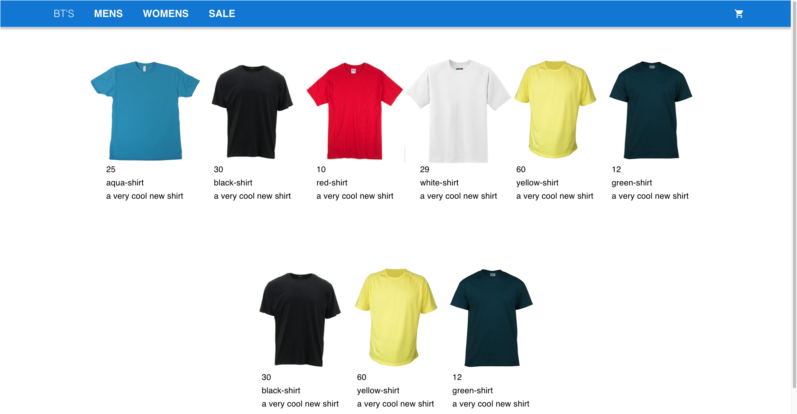

# E Commerce App

## Table of Contents

- [Introduction](#Introduction)
- [Features](#Features)
- [Technologies](#Technologies)
- [Screen Shots](#Screen Shots)
- [Instructions](#Instructions)

## Introduction

This is a simple e-commerce application. Its creation was motivated to utilize multiple storage technologies for both data and images. I did not apply an authorization/ authentication module into the app as this was not the focus for the project. The design of the project uses Mongo DB for details of each of the products and saving the order data from the user. As each product is rendered a call to the Firebase repository will return a link with the product image where they are hosted.

## Features
Application features include: browse catalog of products by category; add, remove or edit shopping cart; submitting shopping cart order.

## Technologies
React
Material UI
Axios
Firebase Formik
Yup
Node.js
Mongo DB
Express JS
CORS
Mongoose
Firebase
MongoDB Atlas

## Screen Shots

### HomePage

### Selected Category Page

### Order Product

### Shopping Cart

## Instructions

* Clone the project into local

* Install all the npm packages. Go into the project folder and type the following command to install all npm packages
npm install (package name)

* Install Create React App
npm install -g create-react-app

* Next you will need to set up a Mongo DB Atlas account. Don’t worry there is a free tier.
Here is a link to get started
[MongoDB Instructions](https://www.mongodb.com/atlas)

* Next you will need to set up a Firebase cloud storage account
Here is a link to the google docs to get started
[Firebase Setup](https://firebase.google.com/docs/firestore/)

* Once your Cloud Storage account is set up you will need to add 6 t-shirt images. I will allow you to find those on google yourself. Follow Firebase instructions on adding images. The fetch module for Firebase is set to locate images in Firebase by file name and uses the products “product name” so make sure that they match. You can find the product names of each product in backend > productData.js. You can modify the product list if you want to auto create more or less products. Once you Firebase account is properly set up go to src>Fetch>Firebase config. Add the account information in the file as requested.

* Now that you have your mongoDB account set up follow the instructions from atlas to add get your db name and password. Once you have both password and db name go to backend>config>db.config.js and replace the db name and password.

* Now that all your hosting needs are connected open two tabs in your terminal. Move into the root of the backend folder in the first tab and laugh using node index.js in terminal. Make sure that backend is launched on port 8087

* In the second tab move to the root or ecommence folder and launch using npm start. Ensure app is launched on port 3000.

* If everything has been configured correctly you should be able to navigate the application with ease.  
